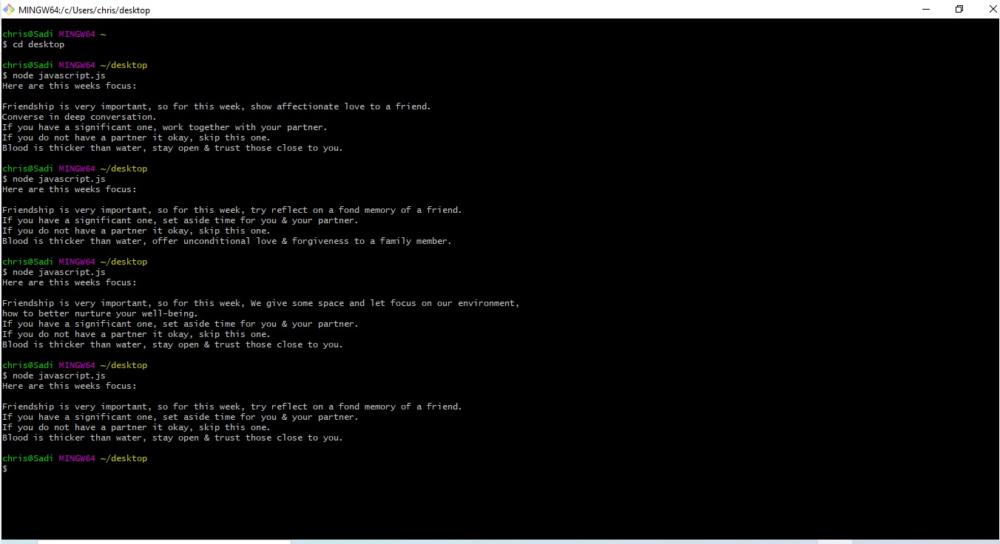

# Mixed Messages - Happy Soul App

A nodes.js console app that generates random advices to follow for the week.

## Table of Contents

- [General Info](#general-information)
- [Technologies Used](#technologies-used)
- [Features](#features)
- [Screenshots](#screenshots)
- [Setup](#setup)
- [Usage](#usage)
- [Project Status](#project-status)
- [Room for Improvement](#room-for-improvement)
- [Acknowledgements](#acknowledgements)
- [Contact](#contact)
<!-- * [License](#license) -->

## General Information

- This is a Codecademy project written in basic JavaScript syntax. This version of the project focuses on generating 3 different pieces of data, made of random output.
- The first output is a random quote picked out of 3 different quote which focuses on friendship.
- The second output is a random quote picked out of 3 different quote which focuses on an intimate relationships.
- Lastly the third output is a random quote picked out of 3 different quote which focuses on family.
- This project is part of the "Full-Stack Engineer" course on codecademy.
<!-- You don't have to answer all the questions - just the ones relevant to your project. -->

## Technologies Used

- VSCode - version 1.60.2
- Nodes.js - version 14.17.5
- Git Bash - version 2.32.0.2

## Features

- Friendship advice
- Relationship advice
- Family advice

## Screenshots

## Setup

You need to have the following installed on your computer:

- Git Bash
- VSCode
- Nodes.js

The code is written in basic javascript syntax on a file called script.js which you will find on this repository.
You can open and run the file on Git Bash as per the screenshot.

## Usage

### To open and run the script

#### Step 1

Open the command line Git Bash run the following command pointing to the folder which contains your script.

`chris@Sadi MINGW64 ~/project-directory node script.js`

As per the screenshot the terminal will printout something like this:

`chris@Sadi MINGW64 ~/project-directory`
`$ node javascript.js`
`Here are this weeks focus:`

`Friendship is very important, so for this week, We give some space and let focus on our environment,`
`how to better nurture your well-being.`
`If you have a significant one, set aside time for you & your partner.`
`If you do not have a partner it okay, skip this one.`
`Blood is thicker than water, stay open & trust those close to you.`

## Project Status

I may revisit and add more to this project once i have finished my course.

## Acknowledgements

- This project was based on [<https://www.codecademy.com/paths/full-stack-engineer-career-path/tracks/fscp-javascript-syntax-portfolio-project/modules/fscp-mixed-messages/kanban_projects/mixed-messages>).

- Many thanks to codecademy for this exposure.

## Contact

Created by [@Christ Sadi) - feel free to contact me!
